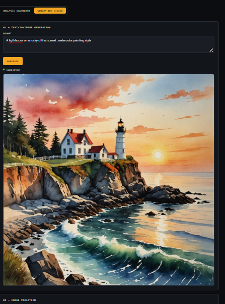

# Evaluation

This document demonstrates the platform's working features with screenshots
and the exact prompts used to produce them.

> **Note for evaluators**: screenshots below were captured running the app
> locally per the README setup steps, with real Anthropic and Stability AI
> API keys configured.

---

## 1. Image Captioning

**Prompt/instruction used:** (none required — captioning runs automatically
on the uploaded image)

**Source image:**

``

**Result:**

``

---

## 2. Visual Question Answering (VQA)

**Question asked:** `"What color is the main object in this image?"`

**Source image:**

``

**Result:**

``

---

## 3. Optical Character Recognition (OCR)

**Source image (containing visible text):**

``

**Result:**

``

---

## 4. Text-to-Image Generation

**Prompt used:** `"A lighthouse on a rocky cliff at sunset, watercolor painting style"`

**Result:**

``

---

## 5. Image Variation

**Source image:**

``

**Style prompt used:** `"Make it look like an oil painting"`

**Result:**

``

---

## 6. Async Polling — Network Tab Evidence

Screenshot of the browser DevTools Network tab during a task, showing the
initial `POST /api/tasks/analyze/caption` returning `202 Accepted`, followed
by repeated `GET /api/tasks/{task_id}` polling requests every ~2 seconds
until the final request returns `COMPLETED`.

``

---

## 7. Database Verification

Screenshot from DBeaver/TablePlus (or `psql`) showing populated rows across
the `images`, `tasks`, and `results` tables with intact foreign key
relationships.

``

---

## 8. Error Handling

Screenshot showing a `FAILED` task state in the UI (e.g. triggered by an
invalid/expired API key, a content-policy-rejected prompt, or a deliberately
broken `STORAGE_ENDPOINT_URL`), with the user-friendly error message
displayed rather than a raw 500.

``
